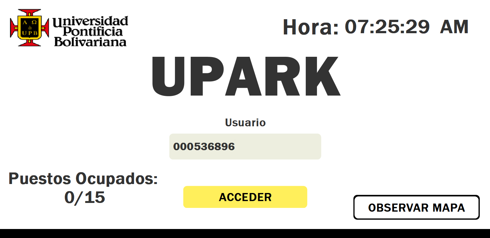
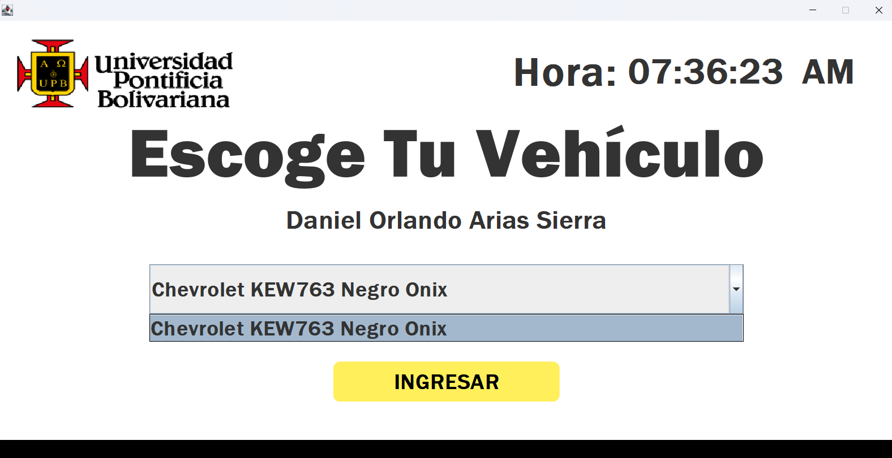
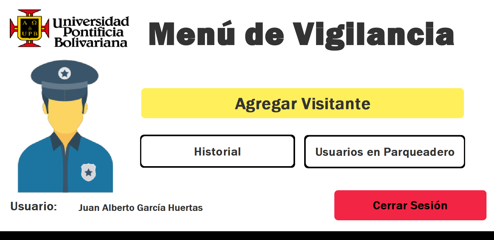
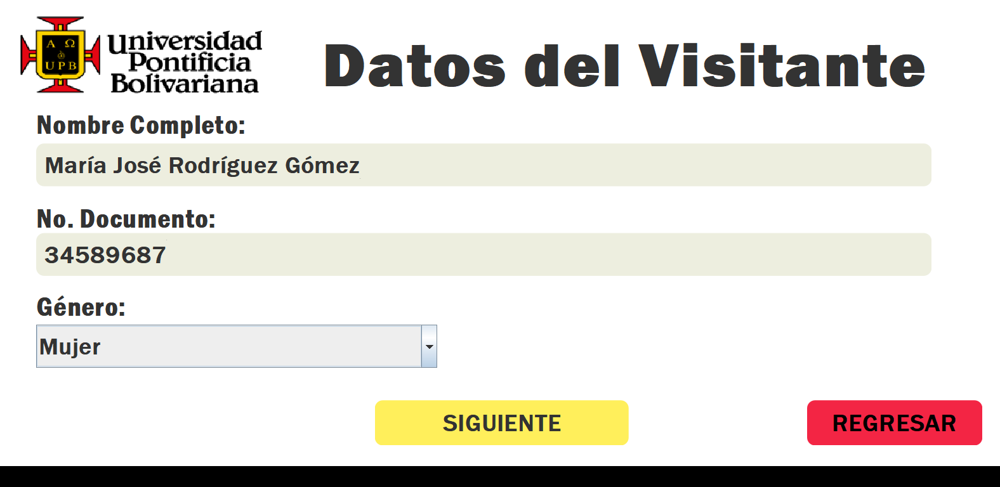

# UPark – Digital Parking Management System

## Problem Statement
The absence of a specific system for managing the parking services at Universidad Pontificia Bolivariana – Bucaramanga Campus has resulted in deficiencies in controlling and organizing the available spaces, which increases the perception of insecurity among users. The lack of an appropriate mechanism hinders monitoring, traffic flow management, and incident prevention, negatively affecting the experience and satisfaction of the university community.

## General Objective
To implement a comprehensive software solution for the management of parking facilities at the Universidad Pontificia Bolivariana – Bucaramanga Campus, by integrating Java and MariaDB technologies with principles of systems analysis and design, with phpMyAdmin used for database administration, in order to streamline operational processes, enhance user experience, and improve the overall perception of control and security within the campus environment.

## Specific Objectives
* To identify the functional and non-functional requirements of the parking management system through user observations, in order to establish a clear development roadmap aligned with campus needs.
* To develop the software components of the parking management system using Java, MariaDB, and phpMyAdmin for database administration, along with iterative SCRUM sprints, in order to deliver a functional solution that effectively addresses the identified campus parking needs.
* To document the progress and results of each development sprint using SCRUM artifacts such as the product backlog, sprint backlog, and sprint reviews, in order to ensure traceability, team alignment, and continuous improvement throughout the project.

## Project Overview
UPark is a software project developed at Universidad Pontificia Bolivariana – Bucaramanga Campus as part of the Systems Analysis and Design course in the second semester of the Systems and Informatics Engineering program. The project aimed to apply theoretical engineering concepts to solve contextual problems within the university environment.

UPark is a software application developed to support the management of parking spaces at the university. It includes features for vehicle registration and exit management, visitor registration, license plate validation, and administrative and security management.

The system was developed using the Java programming language, with a graphical user interface built using Java Swing, and integrated with a MariaDB database. The database was managed using phpMyAdmin.

## Tech Stack

* The database was managed using phpMyAdmin.
* The user interfaces were built using Java Swing, providing a graphical environment for interaction.

## Database

The database management system used for the project was MariaDB, a popular open-source relational database system. The database was administered through a graphical interface using phpMyAdmin, which facilitated tasks such as database design, data entry, and query execution in an intuitive and user-friendly manner.

To view all the content related to the database of the UPark project, you are invited to visit the following repository: [db-upark](https://github.com/Daniel555AS/upark-db)

* __Entity-Relationship Diagram:__  Although MariaDB was used as the database management system and phpMyAdmin served as the web administration tool for the database, the Entity-Relationship diagram was generated through the reverse engineering feature of MySQL Workbench:

	

* __Data Dictionary:__ To view the data dictionary corresponding to the project, you can access the following link: [data-dictionary-upark](https://daniel555as.github.io/upark-db/)

* __SQL Dump File:__ To access the SQL Dump file corresponding to the UPark project, you can use the following link: [sql-dump-file-upark](https://github.com/Daniel555AS/upark-db/blob/main/upark_db.sql)

## Results
You can observe the general operation of the software and all its features in the following video: [Systems Analysis and Design Project: UPark – Digital Parking Management System](https://www.youtube.com/watch?v=9IYIratJslE&t=1s)

Below are some sections resulting from the software project:
* __Login - Home:__ Initial Panel, where the user can enter their identification number to access the parking management system of the Universidad Pontificia Bolivariana – Bucaramanga Campus. Additionally, the panel displays the corresponding parking map, available spaces, and the current time.
  

	

* __Vehicle Selection:__ Vehicle Selection Panel, where the user can choose from their registered vehicles to record the corresponding entry into the university’s parking facilities.
  

	

* __Security Guard Menu:__ Security Menu Panel, where the on-duty security guard can manage various tasks such as adding a visitor, viewing the activity history, checking the current users in the parking area, and finally, logging out of the system.
  

	

* __Visitor Registration:__ Visitor Registration Panel, where the assigned security guard can register a visitor who wishes to use the parking service at the Universidad Pontificia Bolivariana – Bucaramanga Campus. The system requests information such as full name, identification number, gender, and continues with the registration flow for the corresponding vehicle data.
  

	

